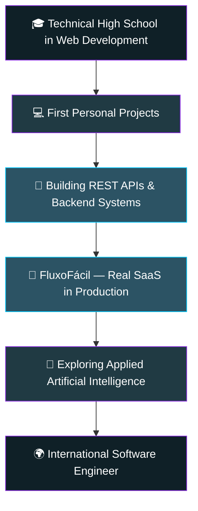

<div align="center">


<br/>

<a href="https://git.io/typing-svg">
  
</a>

<br/><br/>


<br/>


[](https://github.com/s4daniel7?tab=followers)

</div>


<br/>

## 🧑‍💻 About Me


```python
class Daniel:
    def __init__(self):
        self.name = "Daniel Martins Costa"
        self.age = 18
        self.location = "Brasília, DF - Brazil"
        self.role = "CS Student @ UCB | Full Stack Developer"
        self.currently_building = "FluxoFácil (Financial SaaS, in production)"
        self.interests = [
            "Backend Development", "Artificial Intelligence",
            "API Design", "Software Architecture",
            "Cloud & Automation", "SaaS Products"
        ]
        self.currently_seeking = "First Backend / Full Stack opportunity"

    def philosophy(self):
        return "Turn real ideas into real, working, production software."

me = Daniel()
```

- 🎓 Computer Science student at **Universidade Católica de Brasília (UCB)**
- 🖥️ Technical High School graduate in **Web Development**
- 🚀 Self-taught developer who builds and ships **real, production-grade products**
- 💼 Sole developer & product owner of **FluxoFácil**, a multi-tenant financial SaaS with real clients
- 🌍 Long-term goal: become an **international Software Engineer**
- 📚 Always learning — currently deepening my skills in architecture, cloud, and applied AI

<br clear="right"/>


## 🗺️ My Journey

<div align="center">



</div>


## 🛠️ Tech Stack

<div align="center">

**Languages**


**Frameworks & Libraries**


**Database**


**Tools & Platforms**


</div>

<br/>

<div align="center">


**Concepts I work with:**


</div>


## 🚀 Featured Projects

<table width="100%">
<tr>
<td width="50%" valign="top">

### 💰 FluxoFácil
**Financial Management SaaS — in production with real clients**

Complete SaaS platform for small business financial management: cash flow, dashboards, inventory, products, expenses, reports, multi-company & multi-branch support.

`Python` `Flask` `SQLAlchemy` `PostgreSQL` `Bootstrap` `JavaScript` `PWA`


[](https://github.com/s4daniel7/fluxofacil-landing)

</td>
<td width="50%" valign="top">

### ✅ TaskFlow
**Modern Task Management System**

A clean, modern task management application with an intuitive interface for organizing and tracking work.

`Python` `Flask` `PostgreSQL`


[](https://github.com/s4daniel7/taskflow)
[](https://taskflow-weld-phi.vercel.app/)

</td>
</tr>
<tr>
<td width="50%" valign="top">

### 🛒 DevStore API
**Professional REST API built with Flask**

Full-featured REST API with JWT authentication, complete CRUD, organized layered architecture, CI/CD pipeline, and interactive Swagger documentation.

`Python` `Flask` `SQLAlchemy` `PostgreSQL` `JWT` `Swagger` `CI/CD`


[](https://github.com/s4daniel7/devstore-api)
[](https://devstore-api-hwym.onrender.com/docs)

</td>
<td width="50%" valign="top">

### 🤖 Finance AI
**Intelligent financial system powered by AI**

An in-progress project exploring how applied artificial intelligence can bring smarter insights to personal and business finance.

`Python` `AI/ML` `Flask`


</td>
</tr>
</table>


## 📊 GitHub Stats

<div align="center">


<br/>


<br/>


<br/>


</div>

<!-- 🐍 Snake contribution animation.
     To enable: create .github/workflows/snake.yml in this repo using the
     public action Platane/snk, then uncomment the line below.


-->


## 🎧 Now Playing

<!-- Spotify widget — requires linking a Spotify account via a service like
     spotify-github-profile (novatorem). Uncomment and configure to enable.

<div align="center">

</div>

-->

<!-- Discord presence widget — requires a Lanyard-connected Discord account.
     Uncomment and replace DISCORD_USER_ID to enable.

<div align="center">

</div>

-->

<!-- WakaTime coding-time stats — requires a WakaTime account connected to this repo.
     Uncomment once configured to enable.

<div align="center">

```text
📊 Weekly development breakdown:
<!--START_SECTION:waka-->
<!--END_SECTION:waka-->
```

</div>

-->


## 📖 Currently Learning

<div align="center">


</div>

## 🧭 Tech Philosophy

> I believe the best way to learn software engineering is to **ship real products to real users** — not just tutorials. FluxoFácil exists because a small business needed a working financial system, so I built one, put it into production, and I keep refactoring it toward professional standards: proper security, scalable architecture, and clean, tested code. I'd rather have one imperfect product running in the real world than ten perfect ideas that never shipped.

## 🎯 2026 Goals

- [x] Build and ship a real SaaS product (FluxoFácil)
- [ ] Land my first Backend/Full Stack internship or job
- [ ] Harden FluxoFácil's security & architecture to production-grade standards
- [ ] Learn Docker and containerize my projects
- [ ] Learn AWS and cloud deployment fundamentals
- [ ] Apply AI meaningfully in a real product (Finance AI)
- [ ] Make my first Open Source contributions
- [ ] Land my first international opportunity

## 🎲 Fun Facts

- 🏗️ I'm the **sole developer and product owner** of a SaaS platform with real, paying-adjacent clients — at 18.
- 🧠 I use AI tools (Claude, Claude Code, ChatGPT) as real teammates in my workflow, not just for autocomplete.
- 📈 Outside of code, I follow crypto and long-term investing from a fundamentals-first perspective.
- 🎨 I enjoy designing custom visuals (SVG/CSS effects like gooey blobs) for my personal projects.
- ✈️ I've traveled with my friend group, "Efeito TikTok" — good code and good friends, both matter.

## 💬 Quote of the Day

> *"First, solve the problem. Then, write the code."* — John Johnson


## 📫 Let's Connect

<div align="center">

[](https://linkedin.com/in/s4daniel)
[](https://github.com/s4daniel7)
[](mailto:your-email@example.com)

</div>

<div align="center">

*💡 Open to Backend / Full Stack opportunities — let's build something real together.*

</div>


</div>
